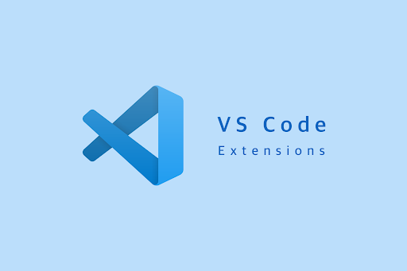

# Curso de React para principiantes

## ⚛️ Qué es React?

React es una biblioteca de código abierto escrita en JavaScript, desarrollada por Facebook en 2013. Su objetivo principal es facilitar la creación de componentes reutilizables e interactivos para las interfaces de usuario. Algunos detalles sobre React:

- **Componentes**: React te permite construir interfaces de usuario a partir de piezas individuales llamadas componentes². Estos componentes pueden ser reutilizados y combinados para formar pantallas, páginas y aplicaciones.

- **JSX**: Es una extensión de la sintaxis de JavaScript utilizada en la creación de elementos de React. Los desarrolladores la emplean para incrustar código HTML en objetos JavaScript.

- **Virtual DOM**: React utiliza un concepto llamado Virtual DOM que ayuda a mejorar el rendimiento al minimizar las actualizaciones directas al DOM.

- **React Native**: Es una plataforma que permite desarrollar aplicaciones móviles utilizando React y JavaScript.

Es importante mencionar que React no es un framework de JavaScript, ya que sólo se encarga de renderizar los componentes de la capa de vista de una aplicación. Es una alternativa a frameworks como Angular y Vue.

## 🤔 Por qué React?

React en comparación con otros frameworks, ofrece algunas cosas como:

1. **Fácil de aprender**: React es mucho más fácil de aprender debido a su simplicidad en términos de sintaxis. Sólo se tiene que confiar en los conocimientos de redacción de HTML.

2. **Alto nivel de flexibilidad y capacidad de respuesta**: React permite una gran flexibilidad y una máxima capacidad de respuesta.

3. **Componentes reutilizables**: Los componentes de React agilizan la creación de una interfaz sensible a cualquier cambio en un sitio web o una aplicación de cualquier complejidad.

4. **Uso eficiente de recursos**: Gracias al DOM virtual, la biblioteca ahorra recursos y tráfico.

5. **JSX**: Esta notación hace más eficiente el desarrollo de aplicaciones escalables.

## 🖥️ Front-End, Qué es?

El término frontend se refiere a la parte visible e interactiva de un sitio web o aplicación. Es la cara visible de un software y el punto de contacto directo para todos los usuarios finales. Permite a los usuarios acceder y solicitar las prestaciones y servicios del sistema de información subyacente.

React es considerado una tecnología frontend porque se utiliza para construir la interfaz de usuario, es decir, la parte de la aplicación con la que los usuarios interactúan directamente.

### 📚 Temario

- 📘 Nivel 1: Fundamentos de JavaScript
- 📘 Nivel 2: Fundamentos de React
- 📘 Nivel 3: Desarrollo práctico
- 📘 Nivel 4: Avanzando en React
- 📘 Nivel 5: Proyectos y mejoras

### 📘 Fundamentos de JavaScript

1. `Fundamentos HTML.` Estructura básica, etiquetas, atributos y sintaxis.
2. `Fundamentos básicos de JavaScript.` Variables, constantes, tipos de datos, operadores, estructuras de control.
3. `Funciones (modernas/clásicas) y objetos (JSON).` Profundizar en funciones, alcance de variables y manejo de objetos (JSON).
4. `Manipulación del DOM.` Qué es el DOM, cómo funciona, estructuras y enlaces.

### 📘 Fundamentos de React

1. `Introduccion.` Comprender conceptos fundamentales como componentes, estados, props y context.
2. `Vite, npm.` Aprender a crear proyectos en React y la estructura básica de archivos (buenas prácticas)
3. `Componentes.` Aprender a crear y renderizar componentes además de extensiones útiles para proyectos en React.
4. `Manejo de Eventos y estados.` Explora cómo manejar los eventos de JavaScript y gestionar los estados en aplicaciones de React.

### 📘 Desarrollo práctico

1. `Context.` Aprende el uso de context y aplícalo para apps sencillas.
2. `Funciones asíncronas.` Qué son, cómo funcionan y cómo se aplican.
3. `Llamadas a APIs.` Descubre como realizar solicitudes a servidores web y trabajar con datos en una aplicación React.

### 📘 Avanzando en React

1. `Hooks.` Estudia los hooks de React (useState, useContext, useEffect)
2. `Testing.` Aprende a escribir pruebas unitarias para tus componentes React.
3. `Despliegue de Aplicaciones.` Descubre cómo desplegar tu aplicación React en un servidor web o en una plataforma de alojamiento.

### 📘 Proyectos y mejoras

1. `Proyecto práctico.` Aplica tus conocimientos construyendo una aplicación web básica completa utilizando React.
2. `Optimización y Mejoras.` Aprende sobre buenas prácticas, optimización de rendimiento y añade características adicionales a tu proyecto.
3. `Explorando Bibliotecas y Frameworks.` Investiga bibliotecas y frameworks relacionados, como Bootstrap, Material UI, Ant Design, entre otras.

## 📱 Apps hechas en React

Algunos ejemplos de aplicaciones famosas que han sido desarrolladas usando React:

1. **Facebook**: Aunque parcialmente, Facebook está haciendo uso de React. Su página web está construida con React.
2. **Instagram**: El uso de ReactJS dentro de Instagram es inmenso. Instagram está completamente basado en la librería React.
3. **Netflix**: React también se usa en Netflix, específicamente en su plataforma llamada Gibbon.

Además, en la página oficial de React, puedes encontrar muchos proyectos de ejemplo creados por la comunidad de React. Algunos ejemplos son:

- **Calculator**: Implementación de la calculadora de iOS hecha con React.
- **Emoji Search**: Aplicación de React para buscar emojis.
- **Snap Shot**: Una galería de fotos con búsqueda.
- **BMI Calculator**: Una aplicación de React con Hooks para calcular BMI (índice de masa corporal).

## 💼 Demanda laboral

La demanda laboral para tecnologías como React en México está en aumento. Según <a href="https://mexico.unir.net/vive-unir/tendencias-mercado-laboral-mexico-2023/">LinkedIn</a>, la tecnología y el comercio son las dos áreas más demandantes en cuestión de empleo. Aunque no se menciona específicamente React en el informe, es seguro asumir que como una de las bibliotecas de JavaScript más populares, React probablemente esté en alta demanda.

Además, la demanda de profesionales en el campo de la tecnología de la información está creciendo. Por ejemplo, el puesto de Ingeniero SRE (Site Reliability Engineering), que a menudo requiere conocimientos de JavaScript y, por lo tanto, potencialmente React, es uno de los trabajos más demandados.

## 📝 Requerimientos previos

Antes de comenzar el curso, es importante tener un entendimiento básico de los siguientes temas:

- **Lógica de programación**: Este curso no es para aprender a programar, sino para aprender React desde lo básico. Por lo que es fundamental entender la lógica de programación.
- **Entorno de desarrollo**: Tener instalado Node.js y un editor de código (de preferencia Visual Studio Code).

## 🚩 Comenzando...

Antes de comenzar, les recomendaré que instalen las siguientes extensiones en Visual Studio Code para facilitar un poco el proceso y hacer más práctica la codificación:

- **Auto Rename Tag**. Esta extension nos facilita el trabajo a la hora de escribir etiquetas HTML, XML o cualquier etiqueta que tenga una etiqueta de apertura y una de cierre.
- **Better comments**. Esta extension sirve para agregar un simbolo y color a los comentarios, con el fin de hacer más práctico y legible el código y el tema en cuestión al comentar algo.
- **Error Lens**. Por otra parte, Error Lens ayuda muchísimo a identificar errores de sintaxis de forma muy rápida y evita un poco perder tiempo buscando un punto y coma o unas comillas faltantes.
- **Prettier**. Esta extension sirve para dar formato a archivos de JavaScript y JSX. Facilitando el trabajo al momento de guardar los cambios del archivo.
- **ES7 + React/Redux/React-Native snippets**. Concretamente, esta extension facilita un poco el trabajo al momento de trabajar con React.

